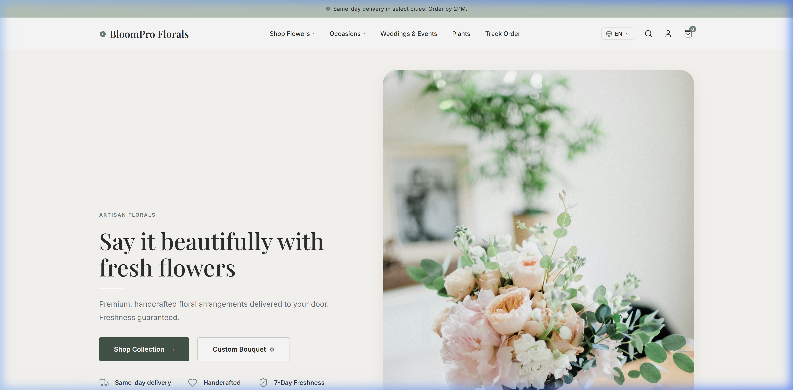
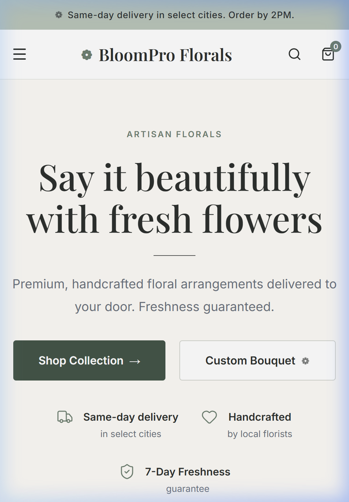
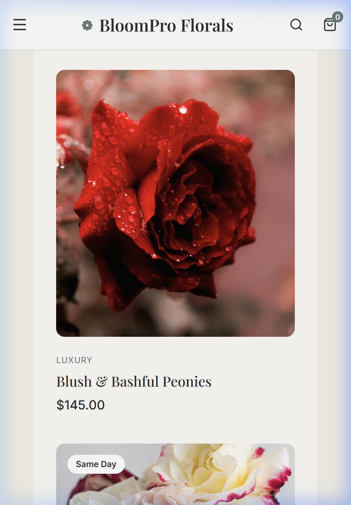

# Storefront UI/UX Refinement & Responsive Walkthrough

This document walks through the visual enhancements, design adjustments, and responsive layout corrections implemented to elevate BloomPro Studio's storefront landing page into a premium, balanced, and fully responsive experience.

---

## Key Achievements

### 1. Above-the-Fold Visual Balance (Desktop)
* **Tightened Vertical Heights:** Reduced vertical padding on the hero container, decreased title font size slightly to `3.5rem`, and minimized margins around the divider, subtitles, and CTA action buttons.
* **Proportionate Sizing:** The main hero copy, primary/secondary action buttons, and trust indicators are now grouped nicely and sit comfortably above the fold, giving the hero image a balanced visual proportion.
* **Fluid Column Layout:** Replaced fixed-minimum-width columns with fluid `minmax(0, 1fr)` layouts, preventing horizontal clipping on medium and small desktop screens.

### 2. Full Mobile Responsiveness & Layout Wrapping
* **Responsive Header Navigation:** Desktop navigation links are hidden on tablets and mobile screens, replaced with a sage-green slide-out mobile drawer menu.
* **Header Spacing Optimization:** The Language Switcher and Staff Login (User Profile) buttons are hidden from the primary header on mobile to prevent icon crowding and horizontal overflow, while remaining fully accessible in the footer of the slide-out menu drawer.
* **Dynamic Grid Stacking:** Verified that the "Most Loved Collections" grid and "Best Sellers" cards stack correctly in 1-column layouts on mobile viewports.
* **No Horizontal Overflow:** Eliminated horizontal page scrolling entirely for viewports as narrow as `375px`.

---

## Visual Verification Artifacts

### Desktop Layout (Above-the-Fold)
The hero section layout is balanced, with tight copy margins and clear call-to-actions placed high on the screen:

---

### Mobile Responsive Header & Hero Stacking
The header now displays only the Logo, Menu, Search, and Cart. The copy and images stack cleanly without horizontal scroll:

---

### Mobile Collections Grid (1-Column Stacked)
The "Most Loved Collections" grid is displayed in a vertical stack with appropriate image aspect ratios:

---

### Mobile Best Sellers Grid (1-Column Stacked)
The Best Sellers cards wrap and stack in a clean, scrollable layout:

---

## Linter & Compiler Validations
* **TypeScript:** Checks passed with zero errors (`npx tsc --noEmit` success).
* **ESLint:** All local changes compile warning-free; codebase linter results remain clean.
* **Security Rules & Accounting Verification:** Hardened rules and backend calculations successfully verify green.
